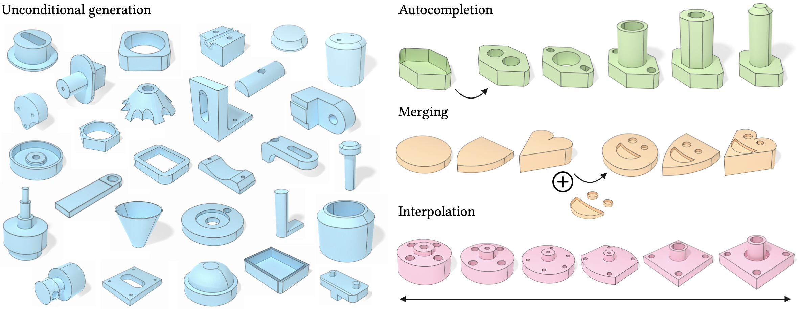

# BrepDiff: Single-stage B-rep Diffusion Model



Official code release for the paper:  
**BrepDiff: Single-stage B-rep Diffusion Model**  
SIGGRAPH 2025  
[Mingi Lee<sup>*</sup>](https://mingilikesmangos.github.io/), [Dongsu Zhang<sup>*</sup>](https://dszhang.me/about), [Clément Jambon<sup>*</sup>](https://clementjambon.github.io/), [Young Min Kim](https://3d.snu.ac.kr/members/)  
<sup>*</sup> Equal contribution  

[[Project page]](https://brepdiff.github.io/) · [[Paper]](https://drive.google.com/file/d/1ZkdjmljmbJer5Lbn55UwKRqR9AcHBydA/view?usp=sharing)

---

## 🌟 Overview

**BrepDiff** is a diffusion-based generative model for 3D Boundary Representations (B-reps). It enables:

- **Single-stage generation** of valid and diverse CAD models
- **Direct editing** operations such as shape completion, merging, and interpolation
- **Efficient generation**, avoiding the complexity and limitations of cascaded pipelines

This repository provides code for training, evaluation, and editing with BrepDiff.

---

## 📚 Table of Contents

- [🛠 Installation](docs/installation.md)
- [🏋️ Training](docs/training.md)
- [🎲 Evaluation on Unconditional Generation](docs/evaluation.md)
- [✏️ Editing B-reps](docs/viewer.md)

---

## 📄 Citation

If you find this work useful, please consider citing:

```bibtex
@inproceedings{lee2025brepdiff,
    author = {Lee, Mingi and Zhang, Dongsu and Jambon, Cl\'{e}ment and Kim, Young Min},
    title = {BrepDiff: Single-Stage B-rep Diffusion Model},
    year = {2025},
    isbn = {9798400715402},
    publisher = {Association for Computing Machinery},
    address = {New York, NY, USA},
    url = {https://doi.org/10.1145/3721238.3730698},
    doi = {10.1145/3721238.3730698},
    booktitle = {Proceedings of the Special Interest Group on Computer Graphics and Interactive Techniques Conference Conference Papers},
    articleno = {103},
    numpages = {11},
    keywords = {Boundary representation, Generative model, Diffusion Model},
    location = {Vancouver, BC, Canada},
    series = {SIGGRAPH Conference Papers '25}
}
---

## 📜 License
This work is licensed under the [Creative Commons Attribution 4.0 International License (CC BY 4.0)](https://creativecommons.org/licenses/by/4.0/).  
You are free to use, modify, and distribute this work, including for commercial purposes, provided that you give appropriate credit.
