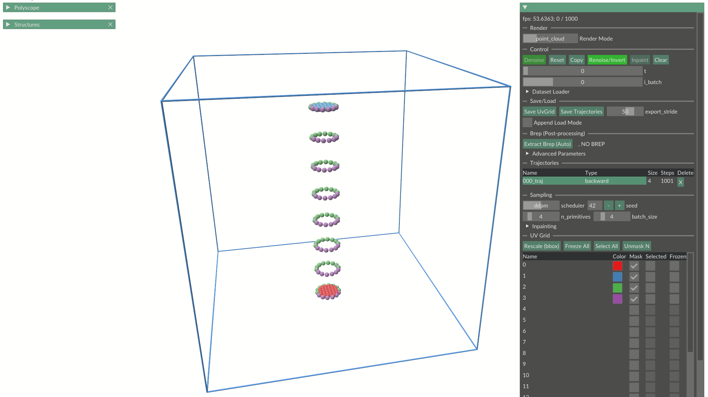
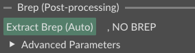
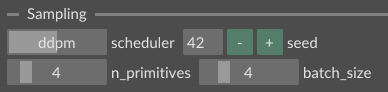
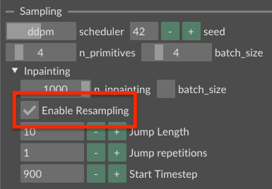
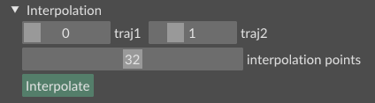
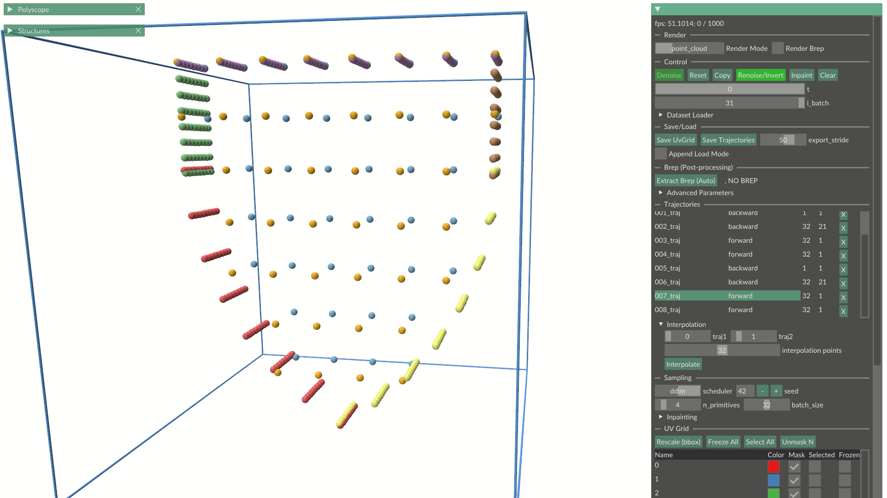

# 🎨 Viewer

Our viewer allows you to generate and edit B-reps using BrepDiff.
It also supports loading and visualizing precomputed denoising trajectories.
A set of illustrative pre-computed [trajectories](#savingloading-trajectories) are available at [TODO].

⚠️⚠️⚠️⚠️⚠️⚠️⚠️⚠️⚠️⚠️⚠️⚠️⚠️⚠️⚠️⚠️⚠️⚠️⚠️⚠️⚠️⚠️⚠️
TODO: updated/add all GIFs and Images

## Generation

Before getting started, make sure that you have properly installed all dependencies including our custom implementation of [Polyscope](https://polyscope.run/py/).

To launch the viewer:
```bash
python scripts/visualization/editor.py --ckpt-path [YOUR_CHECKPOINT].ckpt
```

To start generation, press `Denoise`


After denoising, the timestep slider (`t`) allows you to step through each intermediate diffusion state.
If your batch size is greater than 1, use the batch slider (`i_batch`) to switch between batch samples.



### B-rep Extraction

To extract a B-rep from the generated sample, press `Extract Brep` as shown below.



If post-processing succeeds, you will see a `SUCCESS, HAS BREP` message, and the extracted B-rep will appear in the viewer.
You can save the corresponding `.step` file using the `Save Geometry` button.

> **Note:** If the post-processing algorithm fails, we automatically display the result from the last intermediate state of the algorithm.

### Sampling Parameters

You can adjust the following parameters:



* *Diffusion scheduler*: Choose either [DDPM](https://arxiv.org/abs/2006.11239) or [DDIM](https://arxiv.org/abs/2010.02502). The DDIM scheduler is useful for [interpolation](#interpolation) below.
* *Seed*: Adjust the seed to generate diverse results.
* *Number of primitives*: BrepDiff generates B-reps for a predefined number of faces, which you can adjust here.
* *Batch size*: Adjust the number of samples generated in parallel (batch-wise).
  
### Saving/Loading Trajectories

<!-- Where -->
All generated or loaded trajectories appear in the `Trajectories` section. To switch between them, click on the corresponding row.

<!-- Saving -->
To save all current trajectories, click `Save Trajectories` in the `Save/Load` section. 
A popup will appear allowing you to choose the destination. Make sure the filename ends with `.traj`!

<!-- Loading -->
Once saved, trajectories can be appended to the current state of the viewer by drag-and-dropping the corresponding `.traj` file.

## Auto-completion

We demonstrate auto-completion with a simple example below. If you want to create more complex examples, we recommend editing UV-grids using the [UV-grid editor](#uv-grid-editor) and then importing the corresponding UV-grid files (as `.npz`) into the editor.


To auto-complete a UV-grid with inpainting:
1. Load UV-grids by drag-and-dropping `.step` or `.npz` files.
2. Select the faces you want to inpaint by ticking their `Frozen` checkbox. **Note:** `Selected` is for editing, not inpainting!
3. Run inpainting by clicking `Inpainting`.

By default, inpainting is performed on the same number of faces that are currently unmasked. If you want to sweep over all possible numbers of faces, open the `Inpainting` dropdown in the `Sampling` section and tick the `batch_size` checkbox. You can select the range of faces and specify the number of samples for each. All samples will be generated along the batch dimension.

> **Note:** You can enable [RePaint](https://arxiv.org/abs/2201.09865)-style resampling to obtain better results by ticking the corresponding checkbox. This introduces forward jumps during denoising to enforce better consistency and adherence to the frozen faces. The default parameters should be sufficient.



## Interpolation

BrepDiff enables interpolation between two B-reps by adapting [DDIM Inversion](https://huggingface.co/learn/diffusion-course/en/unit4/2).

To do this, start by inverting two UV-grids.
If a UV-grid was generated (i.e., it already has a complete `backward` trajectory), copy it first.
Otherwise, switch the scheduler to DDIM and click `Renoise/Invert`.

You should see a smooth inversion trajectory similar to the one below:


> **Note:** The sudden flickers within the UV-grid samples are caused by the visibility mask, which is also inverted and thus changes throughout inversion.

Once you have inverted two distinct UV-grids, open the `Interpolation` dropdown in the `Trajectories` section. Select the indices of the two trajectory endpoints you want to interpolate (for example, `traj1` and `traj2`). Then press `Interpolate`. This creates a new trajectory whose endpoints are interpolated along the batch dimension. You can specify the number of interpolation points using the dedicated slider.




> **Note:** Under the hood, we perform optimal matching with respect to the two endpoints to find the best mapping between UV-grids.

Finally, generate the actual interpolated UV-grids by pressing `Denoise`. You should then see something like that:




## UV-grid Editor

We provide a UV-grid editor that lets you convert `.step` files to UV-grids, add or remove faces, and merge multiple UV-grids. 

To open the editor:
```bash
python scripts/visualization/editor.py --ckpt-path [YOUR_CHECKPOINT].ckpt --component uv_grids
```

<!-- Loading -->
To load UV-grids, drag-and-drop either `.step` files or existing `.npz` UV-grid files. 
Once loaded, a new tree node appears on the right, displaying the file path of the grid you just loaded.

<!-- Selection -->
To select or deselect faces, use the checkbox or click directly on the corresponding point samples. 
In the viewer, each face is given a distinct color, which is reflected in the panel on the right.
The entire selection will be highlighted by a global **green** bounding box.

<!-- Transformation -->
To transform the selected faces, use the gizmo.
You can switch the transformation mode with the corresponding slider, or use shortcuts: `r` for rotation, `t` for translation, `e` for both, and `s` for scale.

<!-- UV-mask -->
You can edit the UV mask of a selected face using the dedicated checkbox "matrix". **Note:** Only one face should be selected to enable UV-mask editing.

<!-- Export -->
To export a new UV-grid, tick the `Frozen` checkbox for each desired face. Each frozen face will be surrounded by a distinct **red** bounding box.

> **Note:** Before exporting UV-grids, we recommend rescaling them to fit the unit bounding box by clicking the `Rescale (bbox)` button. Then press `Save Frozen` to save the `.npz` file. You can use this file within the standard viewer for autocompletion or interpolation.